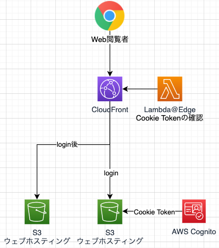
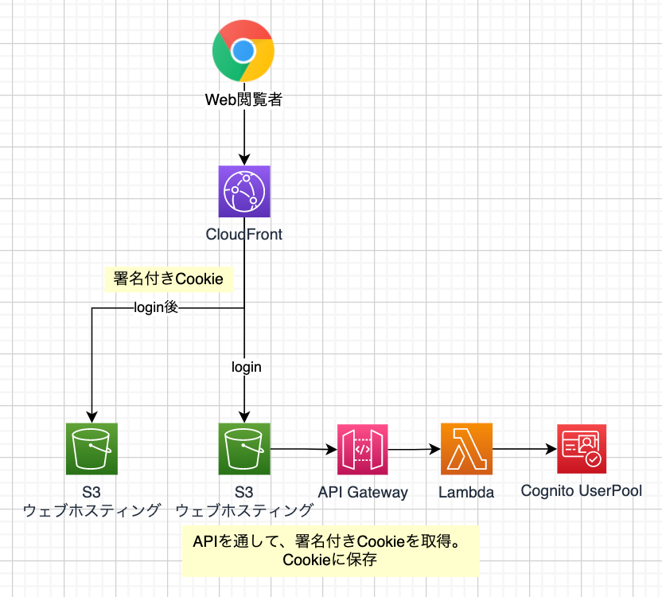

# サーバーレスでプライベートなページが実現可能かを試す
## 案1) AWS Cognito + Lambda@Edge + S3（Static website hosting）

### 使用ツール

 - CDK（v2）
  - Cognito
  - S3
  - Lambda@Edge
  - API Gateway + Lambda
 - Vite(Plugin SSG) + Vue3 + TypeScript

### AWS 構成図

## 案2) CloudFrontの署名付きCookie + S3（Static website hosting）

### 使用ツール

 - CDK（v2）
  - Cognito // IDとパスワード保管用
  - S3
  - API Gateway + Lambda
 - Vite(Plugin SSG) + Vue3 + TypeScript

### AWS 構成図

